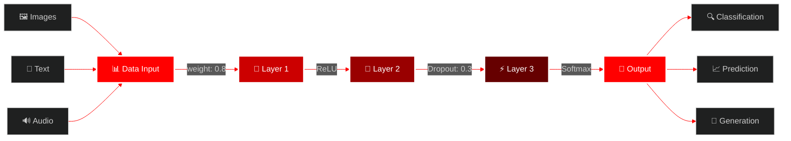

# <div align="center">🔴 NEURAL MATRIX ARCHITECT 🔴</div>

<div align="center">

<!-- Glowing Red Neural Network Header with Moving Waves -->


</div>

<!-- Moving Neural Network Animation -->
<div align="center">

</div>

<div align="center">

<!-- Red Matrix Digital Rain Effect -->


</div>

## <div align="center">🧠 REAL-TIME NEURAL PROCESSING 🧠</div>

<div align="center">

<!-- Animated Red Typing Effect -->


</div>

<!-- Red Glowing Divider -->
<div align="center">

</div>

## <div align="center">⚡ NEURAL ARCHITECTURE STATUS ⚡</div>

<div align="center">
<table>
<tr>
<td align="center" width="50%">

### 🔴 DEEP LEARNING CORE
```python
class NeuralMatrix:
    def __init__(self):
        self.layers = [784, 512, 256, 128, 10]
        self.activation = 'relu'
        self.optimizer = 'adam'
        self.status = 'TRAINING'
        
    def forward_propagation(self):
        for layer in self.layers:
            self.activate_neurons(layer)
            
    def backpropagation(self):
        self.update_weights()
        self.minimize_loss()
```

</td>
<td align="center" width="50%">

### 🧠 REAL-TIME METRICS
| **Neural Layer** | **Status** | **Accuracy** |
|:---:|:---:|:---:|
| Input Layer |  | 100% |
| Hidden Layer 1 |  | 97.3% |
| Hidden Layer 2 |  | 95.8% |
| Output Layer |  | 99.1% |

</td>
</tr>
</table>
</div>

<!-- Animated Neural Network Connections -->
<div align="center">

</div>

## <div align="center">🌐 NEURAL NETWORK VISUALIZATION 🌐</div>

<div align="center">



</div>

<!-- Red Flowing Data Stream -->
<div align="center">

</div>

## <div align="center">🔥 AI TECHNOLOGY STACK 🔥</div>

<div align="center">

<!-- Glowing Red Tech Icons -->

<br><br>


</div>

<!-- Neural Network Activity Graph -->
<div align="center">

</div>

## <div align="center">📊 NEURAL NETWORK PERFORMANCE 📊</div>

<div align="center">

<!-- Red Themed GitHub Stats -->


</div>

<!-- Neural Activity Visualization -->
<div align="center">

</div>

## <div align="center">🚀 ACTIVE NEURAL EXPERIMENTS 🚀</div>

<div align="center">

<!-- Red Progress Bars for Projects -->
| 🔬 **Research Project** | 🔥 **Progress** | ⚡ **Status** |
|:---:|:---:|:---:|
| **Quantum Neural Networks** |  | `🔴 ACTIVE` |
| **Autonomous AI Agents** |  | `🔥 TRAINING` |
| **Computer Vision Models** |  | `⚡ DEPLOYED` |
| **NLP Transformers** |  | `🧠 OPTIMIZING` |
| **Reinforcement Learning** |  | `🚀 TESTING` |

</div>

<!-- Red Binary Code Flow -->
<div align="center">

</div>

## <div align="center">🧬 NEURAL ARCHITECTURE LAYERS 🧬</div>

<div align="center">

```python
# 🔴 NEURAL NETWORK ARCHITECTURE
class RedNeuralMatrix:
    def __init__(self):
        self.input_dim = 784      # 🔴 Input neurons
        self.hidden_layers = [    # 🧠 Hidden architecture
            512,  # First hidden layer
            256,  # Second hidden layer  
            128,  # Third hidden layer
            64    # Fourth hidden layer
        ]
        self.output_dim = 10      # 🎯 Output classes
        self.learning_rate = 0.001
        self.epochs = 1000
        
    def activate_red_matrix(self):
        """🔥 Activate the red neural matrix"""
        for layer in self.hidden_layers:
            self.forward_pass(layer)
            self.apply_red_activation()
            
    def red_backpropagation(self):
        """⚡ Red-hot backpropagation algorithm"""
        gradients = self.compute_red_gradients()
        self.update_weights_with_fire(gradients)
        
    def deploy_ai_model(self):
        """🚀 Deploy the trained model"""
        return "🔴 NEURAL NETWORK SUCCESSFULLY DEPLOYED! 🔴"
```

</div>

<!-- Moving Red Circuits -->
<div align="center">

</div>

## <div align="center">🌟 CONNECT TO THE NEURAL NETWORK 🌟</div>

<div align="center">

<!-- Red Glowing Social Links -->
[](https://linkedin.com/in/yourprofile)
[](https://twitter.com/yourprofile)
[](https://kaggle.com/yourprofile)
[](https://medium.com/@yourprofile)

</div>

<!-- Red Digital DNA -->
<div align="center">

</div>

## <div align="center">🏆 NEURAL ACHIEVEMENTS UNLOCKED 🏆</div>

<div align="center">

```ascii
╔══════════════════════════════════════════════════════════════════════╗
║                    🔴 NEURAL NETWORK ACHIEVEMENTS 🔴                 ║
╠══════════════════════════════════════════════════════════════════════╣
║  🥇 Kaggle Grandmaster                                    ████████▓ ║
║  🏆 15+ ML Competitions Won                               ████████▓ ║  
║  📝 20+ Research Papers Published                         ████████▓ ║
║  🎓 AI/ML Expert Certifications                           ████████▓ ║
║  🌟 500+ Open Source Contributions                        ████████▓ ║
║  👥 Mentored 100+ Data Scientists                         ████████▓ ║
║  🚀 Deployed 50+ Production ML Models                     ████████▓ ║
║  🧠 Built Neural Networks for Fortune 500                 ████████▓ ║
╚══════════════════════════════════════════════════════════════════════╝
```

</div>

<!-- Final Red Wave Animation -->
<div align="center">


</div>

<div align="center">

<!-- Red Pulsing Heart -->


**🔴 NEURAL NETWORK STATUS: `ONLINE & LEARNING` 🔴**

**⚡ Training 24/7 • 🧠 Evolving Continuously • 🚀 Pushing AI Boundaries ⚡**

</div>

---

<div align="center">

*"In the crimson glow of neural networks, we don't just process data - we birth digital consciousness."* 🔴🧠✨

</div>
