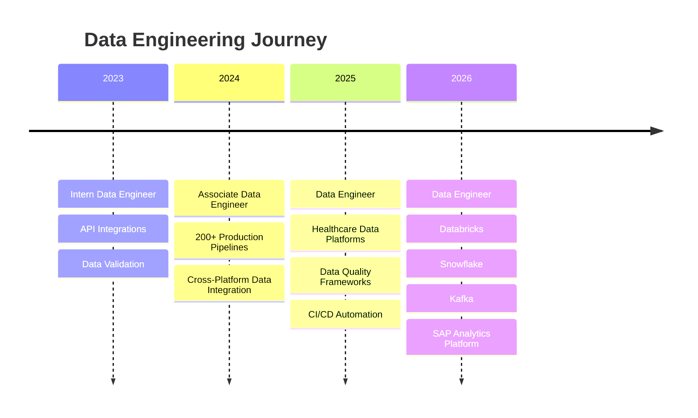

# <div align="center">


</div>

<div align="center">


</div>

---

# 👨‍💻 About Me

I am a **Data Engineer** passionate about building modern data platforms, scalable pipelines, and analytics ecosystems that transform raw enterprise data into trusted business intelligence.

Currently working on enterprise-scale solutions involving:

- Databricks
- Snowflake
- DBT
- Apache Kafka
- Fivetran
- Power BI
- SAP Analytics
- Data Warehousing
- Data Modeling

---

## 🚀 Current Focus

```text
╔══════════════════════════════════════════════════════╗
║ 👨‍💻 Data Engineer                                  ║
║ ☁️ Databricks • Snowflake • DBT • Kafka            ║
║ 🏗️ Data Architecture & Modeling                    ║
║ 📊 Enterprise Analytics Platforms                  ║
║ 🚀 Building Modern Data Warehouses                 ║
╚══════════════════════════════════════════════════════╝
```

---

# 💼 Professional Journey


```mermaid
timeline
    title Data Engineering Journey

    2023 : Intern Data Engineer
         : API Integrations
         : Data Validation

    2024 : Associate Data Engineer
         : 200+ Production Pipelines
         : Cross-Platform Data Integration

    2025 : Data Engineer
         : Healthcare Data Platforms
         : Data Quality Frameworks
         : CI/CD Automation

    2026 : Data Engineer
         : Databricks
         : Snowflake
         : Kafka
         : SAP Analytics Platform
```

---

# 🛠️ Tech Stack

## Data Engineering


## Data Warehousing

- Star Schema
- Snowflake Schema
- Galaxy Schema
- Data Vault Concepts
- Data Marts
- Medallion Architecture

## BI & Analytics

- Power BI
- SSRS
- KPI Design
- Executive Dashboards
- Semantic Models

## DevOps

- Azure DevOps
- Jenkins
- Git
- GitHub Actions

---

# 🏗️ Enterprise Data Engineering Projects

## SAP Enterprise Analytics Platform

```yaml
Source Systems:
  - SAP ERP

Ingestion:
  - Fivetran

Processing:
  - Databricks

Modeling:
  - DBT

Warehouse:
  - Snowflake

Reporting:
  - Power BI

Scale:
  - 10M+ Records Monthly

Architecture:
  - Bronze
  - Silver
  - Gold
```

---

## Real-Time Event Streaming Platform

```yaml
Technology:
  - Kafka
  - DBT
  - Snowflake

Capabilities:
  - Event Streaming
  - Near Real-Time Analytics
  - Data Quality Validation
  - Operational Monitoring
```

---

## Healthcare Data Platform

```yaml
Technology:
  - SQL
  - Azure DevOps
  - Jenkins

Features:
  - Claims Processing
  - Regulatory Reporting
  - Data Validation
  - Automated Deployments
```

---

# 📊 GitHub Analytics

<div align="center">


</div>

---

# 🏆 Career Highlights

- Built and supported 200+ production data pipelines
- Designed enterprise-scale dimensional models
- Implemented Bronze-Silver-Gold architectures
- Delivered Power BI executive dashboards
- Developed real-time Kafka integrations
- Optimized Snowflake workloads by 45%
- Worked across Healthcare, SAP, HRMS, and Analytics domains

---

# 🧠 Engineering Philosophy

```python
class AliHassan:

    def __init__(self):
        self.role = "Data Engineer"

        self.focus = [
            "Data Architecture",
            "Data Modeling",
            "Data Warehousing",
            "Analytics Engineering",
            "Cloud Data Platforms"
        ]

        self.stack = [
            "Databricks",
            "Snowflake",
            "DBT",
            "Kafka",
            "Power BI"
        ]

    def mission(self):
        return "Transform raw data into trusted business intelligence"
```

---

# 📫 Connect With Me

[](https://linkedin.com/in/alihassan572-data-engineer)

[](mailto:chaudharyalihassan572@gmail.com)

---

### Transforming Data into Decisions 📊
