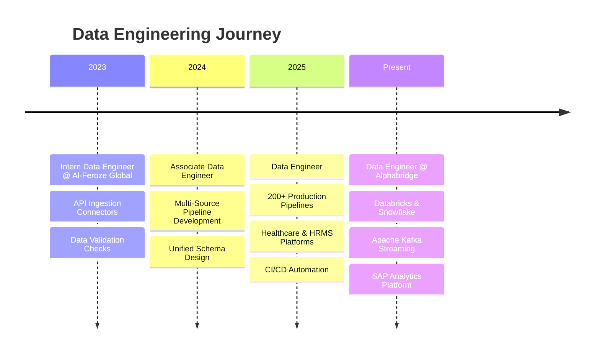

# <div align="center"></div>

<div align="center">

<!-- Animated Typing Effect -->


<!-- Matrix Rain Effect -->


</div>

---

<!-- Snake Animation -->
<h3 align="center">🐍 Contribution Snake</h3>
<div align="center">

<picture>
  <source media="(prefers-color-scheme: dark)" srcset="https://raw.githubusercontent.com/ChaudharyAliHassan572/ChaudharyAliHassan572/output/github-contribution-grid-snake-dark.svg">
  <source media="(prefers-color-scheme: light)" srcset="https://raw.githubusercontent.com/ChaudharyAliHassan572/ChaudharyAliHassan572/output/github-contribution-grid-snake.svg">
  
</picture>
</div>

---

<div align="center">

##  ABOUT ME 

</div>

<!-- Animated Code Gif -->
<div align="center">

</div>

<div align="center">

I turn raw, messy operational data into clean, well-modeled, decision-ready systems. I start from data modeling, work through conceptual, logical, and physical models with deliberate trade-offs, then build SQL, schema design, and ETL/ELT pipelines that keep data accurate and trustworthy downstream. I treat data quality as testable and every table, feed, and report as a contract its consumers depend on.

</div>

### 🎯 **Current Snapshot**

<div align="center">

```ascii
╔═══════════════════════════════════════════════════════╗
║  🎓 CUST University | Computer Software Engineering    ║
║  💼 Data Engineer @ Alphabridge | SAP Analytics       ║
║  🏗️ Databricks • Snowflake • Kafka • dbt • Power BI  ║
║  📊 200+ Production Pipelines | 10M+ Records Monthly  ║
╚═══════════════════════════════════════════════════════╝
```

</div>

---

##  **PROFESSIONAL JOURNEY** 

<div align="center">

</div>


```mermaid
timeline
    title Data Engineering Journey

    2023 : Intern Data Engineer @ Al-Feroze Global
         : API Ingestion Connectors
         : Data Validation Checks

    2024 : Associate Data Engineer
         : Multi-Source Pipeline Development
         : Unified Schema Design

    2025 : Data Engineer
         : 200+ Production Pipelines
         : Healthcare & HRMS Platforms
         : CI/CD Automation

    Present : Data Engineer @ Alphabridge
            : Databricks & Snowflake
            : Apache Kafka Streaming
            : SAP Analytics Platform
```

---

##  **TECH ARSENAL** 

<div align="center">


</div>

### 🔥 **Skill Matrix**

<div align="center">

</div>

**Languages & Core**

<div align="center">


</div>

**Data Platforms & Warehousing**

<div align="center">


</div>

**BI & Reporting**

<div align="center">


</div>

**DevOps & Tooling**

<div align="center">


</div>

---

##  **FEATURED PROJECTS** 

<div align="center">

</div>

### 🏢 **SAP Enterprise Analytics Platform**
<div align="center">

</div>

```yaml
Source:        "SAP ERP"
Ingestion:     "Fivetran"
Processing:    "Databricks"
Modeling:      "dbt"
Warehouse:     "Snowflake"
Reporting:     "Power BI"
Architecture:  "Bronze / Silver / Gold (Medallion)"
Highlights:
  - "10M+ SAP records processed monthly"
  - "Dimensional models: Star, Galaxy, Snowflake schema"
  - "45% reduction in Snowflake query execution time"
  - "Data quality, reconciliation & automated validation"
```

### ⚡ **Real-Time Event Streaming Platform**
<div align="center">

</div>

```yaml
Technology:    "Apache Kafka + dbt + Snowflake"
Capabilities:
  - "Event-driven data processing"
  - "Near real-time operational analytics"
  - "Data quality validation & monitoring"
Impact:        "Reduced latency for operational reporting"
```

### 🏥 **Healthcare Data Platform (FROI / SROI)**
<div align="center">

</div>

```yaml
Technology:    "SQL + Azure DevOps + Jenkins"
Capabilities:
  - "Claims & injury reporting (FROI/SROI)"
  - "Regulatory data processing"
  - "CI/CD across DEV / QA / UAT / Production"
  - "Automated data quality testing"
```

---

##  **GITHUB STATISTICS** 

<div align="center">


</div>

---

##  **ACHIEVEMENTS & LEADERSHIP** 

<div align="center">

</div>

<div align="center">

| 🗓️ Year | 🏆 Highlight | 🎯 Result |
|---------|-------------|-----------|
| **2024** | Inter-Departmental FYP Competition (ETL Online) | 🥇 1st Position |
| **2024** | CUST Hackathon | Participant |
| **2024** | GIK ICPC Onsite Competition | Participant |
| **2023** | National ICPC Ranking, Pakistan | 31st Position |
| **2022** | National ICPC Competition | 92nd Position |

</div>

### 👑 **President | AICP Society**

<div align="center">

```ascii
╭─────────────────────────────────────────────────╮
│  📅 30+ events organized                        │
│  🤝 3,000+ students impacted                    │
│  🌍 Built and scaled a thriving tech community  │
│  💡 Technology & innovation advocate            │
╰─────────────────────────────────────────────────╯
```

</div>

---

##  **ENGINEERING PHILOSOPHY** 

<div align="center">

</div>

```python
class AliHassan:
    def __init__(self):
        self.name = "Ali Hassan Chaudhary"
        self.role = "Data Engineer | Data Architect in Progress"
        self.focus = [
            "Data Architecture & Modeling",
            "Cloud Data Platforms (Snowflake, Databricks)",
            "Real-Time Streaming (Kafka)",
            "Analytics Engineering (dbt, Power BI)",
        ]
        self.principle = "Every table, feed, and report is a contract"

    def approach(self):
        # design from the schema up
        # assume schemas evolve and systems fail
        # document the reasoning so it outlives me
        return "Treat data quality as testable, not assumed"

    def mission(self):
        return "Transform raw data into trusted business intelligence"


ali = AliHassan()
print(ali.mission())
# Output: Transform raw data into trusted business intelligence
```

---

##  **CONNECT** 

<div align="center">

</div>

<div align="center">

[](https://www.linkedin.com/in/alihassan572-data-engineer/)
[](mailto:chaudharyalihassan572@gmail.com)

### 🌟 **"Transforming Data into Decisions"** 🌟

</div>

---

<div align="center">


</div>


