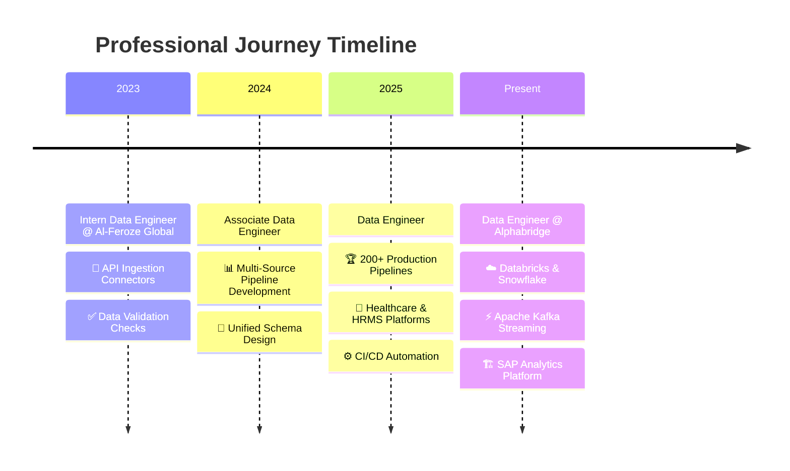

# <div align="center"></div>

<div align="center">

<!-- Animated Typing Effect -->


<!-- Matrix Rain Effect -->


</div>

---

<!-- WORKING Snake Animation - Multiple Options -->
<h3 align="center">🐍 Contribution Snake</h3>
<div align="center">

<!-- Primary Snake Animation (Platane's SNK - Most Reliable) -->
<picture>
  <source media="(prefers-color-scheme: dark)" srcset="https://raw.githubusercontent.com/ChaudharyAliHassan572/ChaudharyAliHassan572/output/github-contribution-grid-snake-dark.svg">
  <source media="(prefers-color-scheme: light)" srcset="https://raw.githubusercontent.com/ChaudharyAliHassan572/ChaudharyAliHassan572/output/github-contribution-grid-snake.svg">
  
</picture>
</div>

---

<div align="center">

##  THE LEGEND IN MAKING 

</div>

<!-- Animated Code Gif -->
<div align="center">

</div>

### 🎯 **Current Status: BUILDING THE FUTURE**

<div align="center">

```ascii
╔═══════════════════════════════════════════════════════╗
║  🎓 CUST University | Software Engineering | BS Degree ║
║  💼 Data Engineer @ Alphabridge | SAP Analytics       ║
║  🏗️ Databricks • Snowflake • Kafka • dbt • Power BI  ║
║  📊 200+ Production Pipelines | 10M+ Records Monthly  ║
║  🌟 President of AICP Society | 30+ Events Organized  ║
╚═══════════════════════════════════════════════════════╝
```

</div>

---

##  **PROFESSIONAL JOURNEY** 

<div align="center">

</div>

### 💼 **Elite Experience Trail**


```mermaid
timeline
    title Professional Journey Timeline

    2023 : Intern Data Engineer @ Al-Feroze Global
         : 🔌 API Ingestion Connectors
         : ✅ Data Validation Checks

    2024 : Associate Data Engineer
         : 📊 Multi-Source Pipeline Development
         : 🧩 Unified Schema Design

    2025 : Data Engineer
         : 🏆 200+ Production Pipelines
         : 🏥 Healthcare & HRMS Platforms
         : ⚙️ CI/CD Automation

    Present : Data Engineer @ Alphabridge
            : ☁️ Databricks & Snowflake
            : ⚡ Apache Kafka Streaming
            : 🏗️ SAP Analytics Platform
```

---

##  **TECH ARSENAL** 

<div align="center">


</div>

### 🔥 **Skill Matrix**

<div align="center">

<table>
<tr>
<td align="center" width="96">

<br><strong>Python</strong>
</td>
<td align="center" width="96">

<br><strong>SQL</strong>
</td>
<td align="center" width="96">

<br><strong>C++</strong>
</td>
<td align="center" width="96">

<br><strong>Azure</strong>
</td>
<td align="center" width="96">

<br><strong>Git</strong>
</td>
<td align="center" width="96">

<br><strong>Jenkins</strong>
</td>
</tr>
<tr>
<td align="center" width="96">

<br><strong>Docker</strong>
</td>
<td align="center" width="96">

<br><strong>GitHub</strong>
</td>
<td align="center" width="96">

<br><strong>Snowflake</strong>
</td>
<td align="center" width="96">

<br><strong>Databricks</strong>
</td>
<td align="center" width="96">

<br><strong>dbt</strong>
</td>
<td align="center" width="96">

<br><strong>Kafka</strong>
</td>
</tr>
</table>

</div>

---

##  **LEGENDARY PROJECTS** 

<div align="center">

</div>

### 🏢 **SAP Enterprise Analytics Platform**
<div align="center">

</div>

**🎯 The Crown Jewel of Enterprise Data Architecture**

```yaml
Technology Stack:
  Source: "SAP ERP"
  Ingestion: "Fivetran"
  Processing: "Databricks"
  Modeling: "dbt"
  Warehouse: "Snowflake"
  Reporting: "Power BI"
  Architecture: "Bronze • Silver • Gold (Medallion)"
  Features:
    - 🔄 10M+ SAP records processed monthly
    - 🏗️ Dimensional models (Star, Galaxy, Snowflake)
    - 📊 Executive KPI dashboards & semantic models
    - ⚡ 45% Snowflake query optimization
    - ✅ Data quality & reconciliation frameworks
```

### ⚡ **Real-Time Event Streaming Platform**
<div align="center">

</div>

**🚀 Near Real-Time Analytics at Scale**

```yaml
Innovation Level: "🌟 Event-Driven"
Technology: "Apache Kafka + dbt + Snowflake"
Impact: "Reduced latency for operational reporting"
Capabilities: "Event Streaming + Data Quality Validation + Operational Monitoring"
```

### 🏥 **Healthcare Data Platform (FROI/SROI)**
<div align="center">

</div>

---

##  **COMPETITIVE PROGRAMMING LEGEND** 

<div align="center">

</div>

### 🏆 **Hall of Fame**

<div align="center">

| 🗓️ **Year** | 🏆 **Achievement** | 🎯 **Rank** | 🌟 **Status** |
|-------------|-------------------|-------------|---------------|
| **2024** | 🥇 **Inter-Departmental FYP** | **1st Position** | 👑 **CHAMPION** |
| **2024** | 🏆 CUST HACKATHON | **Participant** | 👑 **CHAMPION** |
| **2024** | ⚡ GIK Onsite Competition | participant | 🔥 **ELITE** |
| **2023** | 🇵🇰 **NATIONAL ICPC RANKING 2023** | **31st in Pakistan** | 🌟 **LEGENDARY** |
| **2022** | 🚀 National ICPC Competition 2022 | 92nd Position | 💎 **RISING STAR** |

</div>

<div align="center">

</div>

---

##  **GITHUB UNIVERSE STATISTICS** 

<div align="center">

<!-- GitHub Stats Cards with Glowing Red and Black Theme -->


<!-- Language Stats with Glowing Red and Black Theme -->


<!-- GitHub Streak with Glowing Red and Black Theme -->


<!-- Activity Graph with Glowing Red and Black Theme -->


<!-- Trophy Collection with Glowing Red and Black Theme -->


</div>

---

##  **LEADERSHIP IMPACT** 

<div align="center">

</div>

### 👑 **President | Cause & AICP Society**

<div align="center">

```ascii
╭─────────────────────────────────────────────────╮
│  🎯 ACHIEVEMENTS UNLOCKED                       │
├─────────────────────────────────────────────────┤
│  🥇 1st Position FYP Competition (ETL Online)   │
│  🏆 31st National Position in ICPC Pakistan     │
│  📅 30+ Premium Events Organized               │
│  🤝 Impacted 3,000+ Students                   │
│  🌍 Built Thriving Tech Community              │
│  💡 Innovation & Technology Advocate           │
│  🚀 Mentored 100+ Aspiring Developers          │
╰─────────────────────────────────────────────────╯
```

</div>

---

##  **CODE PHILOSOPHY** 

<div align="center">

</div>

```python
class AliHassan:
    def __init__(self):
        self.name = "Ali Hassan Chaudhary"
        self.role = "Data Engineer | Data Architect in Progress"
        self.current_focus = [
            "🏗️ Data Architecture & Modeling",
            "☁️ Cloud Data Platforms (Snowflake, Databricks)",
            "⚡ Real-Time Streaming (Kafka)",
            "📊 Analytics Engineering (dbt, Power BI)"
        ]
        self.philosophy = "Every table, feed, and report is a contract"
        self.motto = "Transform raw data into trusted business intelligence!"

    def get_superpower(self):
        return {
            "🧠": "Data Modeling & Schema Design",
            "⚡": "ETL/ELT Pipeline Engineering",
            "🎯": "Data Quality as a Discipline",
            "🚀": "Scalable Enterprise Platforms"
        }

    def current_mission(self):
        return "Turning raw, messy data into decision-ready systems! 🌍"

# Initialize the legend
ali = AliHassan()
print(ali.current_mission())
# Output: Turning raw, messy data into decision-ready systems! 🌍
```

---

##  **CONNECT WITH THE LEGEND** 

<div align="center">

</div>

<div align="center">

[](https://www.linkedin.com/in/alihassan572-data-engineer/)

[](mailto:chaudharyalihassan572@gmail.com)
[](https://wa.me/9231933333)


### 🌟 **"Let's Build Something Revolutionary Together!"** 🌟

</div>

---

##  **EASTER EGGS & SECRETS** 

<details>
<summary>🎮 <b>Click to unlock hidden achievements!</b></summary>

<div align="center">

</div>

### 🏆 **Achievement System**
```ascii
╭─────────────────────────────────────────────────╮
│  🏅 200+ PRODUCTION PIPELINES BUILT             │
│  🥇 1st POSITION FYP CHAMPION (ETL ONLINE)      │
│  ⭐ 31st POSITION NATIONAL ACHIEVER             │
│  🎯 HACKATHON CHAMPION                          │
│  👑 TECH COMMUNITY PRESIDENT                    │
│  🏗️ ENTERPRISE DATA PLATFORM ARCHITECT         │
│  ⚡ REAL-TIME STREAMING PIONEER                 │
│  💎 SNOWFLAKE + DATABRICKS MASTERY UNLOCKED     │
╰─────────────────────────────────────────────────╯
```

### 🎭 **Fun Facts**
- 🔥 Built and supported 200+ production data pipelines
- 🎯 Organized 30+ tech events impacting 3,000+ students
- 🚀 Processes 10M+ SAP records monthly at scale
- 🤖 Reduced manual reporting efforts by 80% with Power BI
- 💻 Treats data quality as testable and every table as a contract

</details>

---

<div align="center">

###  **"The future belongs to those who code it!"** 


**⭐ Star my repositories if you find them revolutionary! ⭐**

---

 *Last updated: Real-time via GitHub Actions* 

</div>


