# <div align="center"></div>

<div align="center">

<!-- Animated Typing Effect -->


<!-- Matrix Rain Effect -->


</div>

---

<!-- WORKING Snake Animation - Multiple Options -->
<div align="center">
  
## 🐍 **Contribution Snake**

<!-- Primary Snake Animation (Platane's SNK - Most Reliable) -->
<picture>
  <source media="(prefers-color-scheme: dark)" srcset="https://raw.githubusercontent.com/ChaudharyAliHassan572/ChaudharyAliHassan572/output/github-contribution-grid-snake-dark.svg">
  <source media="(prefers-color-scheme: light)" srcset="https://raw.githubusercontent.com/ChaudharyAliHassan572/ChaudharyAliHassan572/output/github-contribution-grid-snake.svg">
  
</picture>

<!-- Alternative Snake Animation (Backup) -->
<!-- 

-->

<!-- If both fail, cool alternative -->
<!--

-->

</div>

---

<div align="center">

##  THE LEGEND IN MAKING 

</div>

<!-- Animated Code Gif -->
<div align="center">

</div>

### 🎯 **Current Status: BUILDING THE FUTURE**

<div align="center">

```ascii
╔═══════════════════════════════════════════════════════╗
║  🎓 CUST University | Software Engineering | 3.93 CGPA ║
║  🏆 ICPC Rank:      | 31st Position in Pakistan (2023) ║
║  🥇 1st Position: Inter-Departmental FYP (ETL Online)  ║
║  💼 Full-Stack Developer | AI Engineer | Team Leader   ║
║  🌟 President of AICP Society | 25+ Events Organized   ║
╚═══════════════════════════════════════════════════════╝
```

</div>

---

##  **PROFESSIONAL JOURNEY** 

<div align="center">

</div>

### 💼 **Elite Experience Trail**

```mermaid
timeline
    title Professional Journey Timeline
    
    2022 : Competitive Programming Start
         : 🏆 92nd National ICPC Position
         
    2023 : Major Breakthrough
         : 🥇 31st Pakistan ICPC Position
         : 📊 Data Science Internship (Oasis)
         
    2024 : Career Expansion & Major Wins
         : 🏅 GIK ICPC Onsite Competition
         : 🥇 1st Position FYP Competition (ETL Online)
         
    Present : Leadership & Innovation
            : 🚀 Full-Stack Mastery
            : 🤖 AI Innovation Leader
            : 👑 AICP Society President
```



---

##  **TECH ARSENAL** 

<div align="center">


</div>

### 🔥 **Skill Matrix**

<div align="center">

<table>
<tr>
<td align="center" width="96">

<br><strong>Python</strong>
</td>
<td align="center" width="96">

<br><strong>C#</strong>
</td>
<td align="center" width="96">

<br><strong>JavaScript</strong>
</td>
<td align="center" width="96">

<br><strong>React</strong>
</td>
<td align="center" width="96">

<br><strong>Angular</strong>
</td>
<td align="center" width="96">

<br><strong>.NET</strong>
</td>
</tr>
<tr>
<td align="center" width="96">

<br><strong>PyTorch</strong>
</td>
<td align="center" width="96">

<br><strong>TensorFlow</strong>
</td>
<td align="center" width="96">

<br><strong>AWS</strong>
</td>
<td align="center" width="96">

<br><strong>Docker</strong>
</td>
<td align="center" width="96">

<br><strong>MongoDB</strong>
</td>
<td align="center" width="96">

<br><strong>Node.js</strong>
</td>
</tr>
</table>

</div>

---

##  **LEGENDARY PROJECTS** 

<div align="center">

</div>

### 🏢 **TaskFlow - Enterprise Task Management System**
<div align="center">

</div>

**🎯 The Crown Jewel of Full-Stack Architecture**

```yaml
Technology Stack:
  Backend: "C# ASP.NET Core Web API"
  Frontend: "Angular with TypeScript"
  Database: "SQL Server"
  Real-time: "SignalR WebSockets"
  Authentication: "JWT with Role-based Access"
  Features:
    - 🔄 Real-time task updates
    - 👥 Role-based permissions
    - 📊 Interactive analytics dashboard
    - 📁 Advanced file management
    - 🎨 Modern responsive UI
```

### 🧠 **AlgoInsight - AI Interpretability Pioneer**
<div align="center">

</div>

**🚀 Making Black-Box AI Transparent**

```yaml
Innovation Level: "🌟 Revolutionary"
Technology: "Flask + PyTorch + Explainable AI + GradCam + Lime + Shap + Captum + Superpoint + Fpdf + Pandas + Numpy + Scikit-Learn + Seaborn + Tensorflow"
Impact: "Research-grade AI interpretability"
Status: "Final Year Project Success"
```

### 🛡️ **Multi-Algorithm Encryption System**
<div align="center">

</div>

---

##  **COMPETITIVE PROGRAMMING LEGEND** 

<div align="center">

</div>

### 🏆 **Hall of Fame**

<div align="center">

| 🗓️ **Year** | 🏆 **Achievement** | 🎯 **Rank** | 🌟 **Status** |
|-------------|-------------------|-------------|---------------|
| **2024** | 🥇 **Inter-Departmental FYP** | **1st Position** | 👑 **CHAMPION** |
| **2024** | 🏆 CUST HACKATHON | **Participant** | 👑 **CHAMPION** |
| **2024** | ⚡ GIK Onsite Competition | participant | 🔥 **ELITE** |
| **2023** | 🇵🇰 **NATIONAL ICPC RANKING 2023** | **31st in Pakistan** | 🌟 **LEGENDARY** |
| **2022** | 🚀 National ICPC Competition 2022 | 92nd Position | 💎 **RISING STAR** |

</div>

<div align="center">

</div>

---

##  **GITHUB UNIVERSE STATISTICS** 

<div align="center">

<!-- GitHub Stats Cards with Glowing Red and Black Theme -->


<!-- Language Stats with Glowing Red and Black Theme -->


<!-- GitHub Streak with Glowing Red and Black Theme -->


<!-- Activity Graph with Glowing Red and Black Theme -->


<!-- Trophy Collection with Glowing Red and Black Theme -->


</div>

---

##  **LEADERSHIP IMPACT** 

<div align="center">

</div>

### 👑 **President | Cause & AICP Society**

<div align="center">

```ascii
╭─────────────────────────────────────────────────╮
│  🎯 ACHIEVEMENTS UNLOCKED                       │
├─────────────────────────────────────────────────┤
│  🥇 1st Position FYP Competition (ETL Online)   │
│  🏆 31st National Position in ICPC Pakistan     │
│  📅 25+ Premium Events Organized               │
│  🤝 Ambassador of 6+ Tech Companies            │
│  🌍 Built Thriving Tech Community              │
│  💡 Innovation & Technology Advocate           │
│  🚀 Mentored 100+ Aspiring Developers          │
╰─────────────────────────────────────────────────╯
```

</div>

---

##  **CODE PHILOSOPHY** 

<div align="center">

</div>

```python
class AliHassan:
    def __init__(self):
        self.name = "Ali Hassan Chaudhary"
        self.role = "Full-Stack Software Engineer"
        self.current_focus = [
            "🏢 Enterprise Solutions Architecture",
            "🤖 AI/ML Innovation & Research", 
            "🚀 Scalable System Design",
            "👥 Technical Leadership"
        ]
        self.philosophy = "Clean, Scalable, Revolutionary"
        self.motto = "Building tomorrow's solutions today!"
    
    def get_superpower(self):
        return {
            "🧠": "Complex Problem Solving",
            "⚡": "Rapid Prototyping",
            "🎯": "Technical Leadership",
            "🚀": "Innovation Catalyst"
        }
    
    def current_mission(self):
        return "Creating digital solutions that change the world! 🌍"

# Initialize the legend
ali = AliHassan()
print(ali.current_mission())
# Output: Creating digital solutions that change the world! 🌍
```

---

##  **CONNECT WITH THE LEGEND** 

<div align="center">

</div>

<div align="center">

[](https://www.linkedin.com/in/alihassan572/)
[](mailto:chaudharyalihassan4@gmail.com)
[](https://wa.me/923303097272)

### 🌟 **"Let's Build Something Revolutionary Together!"** 🌟

</div>

---

##  **EASTER EGGS & SECRETS** 

<details>
<summary>🎮 <b>Click to unlock hidden achievements!</b></summary>

<div align="center">

</div>

### 🏆 **Achievement System**
```ascii
╭─────────────────────────────────────────────────╮
│  🏅 COMPETITIVE PROGRAMMING LEGEND              │
│  🥇 1st POSITION FYP CHAMPION (ETL ONLINE)      │
│  ⭐ 31st POSITION NATIONAL ACHIEVER             │
│  🎯 HACKATHON CHAMPION                          │
│  👑 TECH COMMUNITY PRESIDENT                    │
│  🚀 ENTERPRISE SOLUTION ARCHITECT               │
│  🤖 AI INNOVATION PIONEER                       │
│  💎 FULL-STACK MASTERY UNLOCKED                 │
╰─────────────────────────────────────────────────╯
```

### 🎭 **Fun Facts**
- 🔥 Can solve algorithmic problems faster than brewing coffee
- 🎯 Organized 25+ tech events and still counting
- 🚀 Built enterprise systems that handle thousands of users
- 🤖 Created AI models that actually understand context
- 💻 Writes code that other developers call "poetry"

</details>

---

<div align="center">

###  **"The future belongs to those who code it!"** 


**⭐ Star my repositories if you find them revolutionary! ⭐**

---

 *Last updated: Real-time via GitHub Actions* 

</div>


